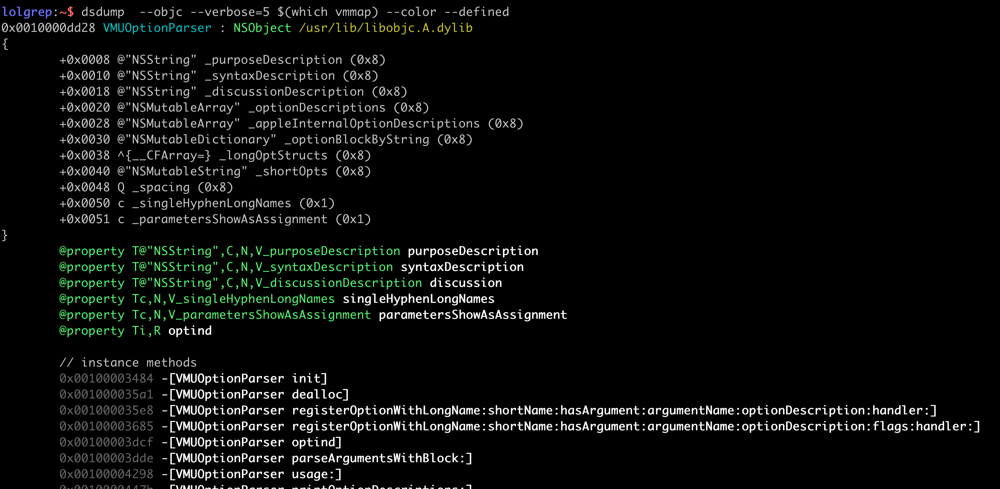
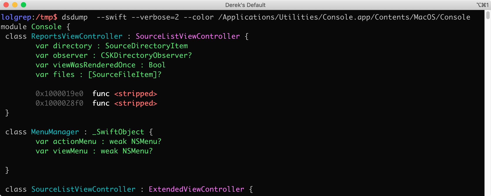

## dsdump 
An improved nm + objc/swift class-dump ([writeup](https://derekselander.github.io/dsdump/))

Works great on Objective-C classes
[](https://store.raywenderlich.com/products/advanced-apple-debugging-and-reverse-engineering)

... and Swift types
[](https://store.raywenderlich.com/products/advanced-apple-debugging-and-reverse-engineering)

### man

<!--man_start--->
```
dsdump(1)                 BSD General Commands Manual                dsdump(1)

NAME
     dsdump -- An improved nm + objc/swift class-dump

SYNOPSIS
     dsdump [option...] <mach-o-file>

DESCRIPTION
     Provides an "nm-improved" experience when working with Mach-O executa-
     bles. dsdump has 3 "primary" modes: Symbol table (--sym), Objective-C
     (--objc), and Swift (--swift, -s). Omitting all of these options will
     default to the Swift mode.

OPTIONS
     -c, --color
             Adds color to output

     -l, --library
             Instead of dumping symbols, search all procs for library

     -O, --opcs
             Dump the DYLD opcodes used to bind external symbols at load time

     -f, --filter FilterWord
             Specify classes to filter by (case insensitive, can be used mul-
             tiple times)

     -a, --arch architecture
             Specify the arichtecture if file is FAT. Understands x86_64h,
             x86_64, arm64, arm64e

     -u, --undefined
             Only display undefined (externally referenced) symbols or classes

     -U, --defined
             Only display defined (internally implemented) symbols or classes

     -v, --verbose
             Specifies the verbosity level. The -v option can be used multiple
             times, while the long argument sets the exact level 0-5. Kind of
             like codesign(1)'s verbosity that everyone complains about...

     --objc  Dump the Objective-C classes

     --swift
             Dump the Swift type descriptors (classes, structs, enums)

     -s      Sets mode to Swift mode and verbosity to level 4

     -h, --help
             Print out this beautiful, helpful document

EXAMPLES
     List ObjC internal/external classes referenced/implemented by vmmap:
           dsdump --objc $(which vmmap)

     List all alive processes that have the MobileDevice loaded
           sudo dsdump -l /S*/L*/P*/MobileDevice.framework/MobileDevice

     List the Objective-C external classes called by vmmap:
           dsdump --objc $(which vmmap) -u

     List the Objective-C internal classes implemented by vmmap:
           dsdump --objc $(which vmmap) -U

     Perform an Objective-C "class-dump" in color of vmmap
           dsdump --objc $(which vmmap) -U -vvvc

     Thoroughly dump the Swift content in color in the Console app
           dsdump --swift
           /Applications/Utilities/Console.app/Contents/MacOS/Console -cvvvv

VERBOSITY
     dsdump can output a range of verbosity between the 3 different modes
     (--sym, --swift, --objc). The verbosity level can be set by the long form
     (--verbose=3) or by specifying a count via short form (-vvv). The break-
     down of these levels are shown below:

     --sym:
           0. Print symbol
           1. 0 + library path or Mach-O section
           2. 1 + fullpath to library
           3. 2 + nlist struct output
           4. Same as 3... for now
           5. Same as 3... for now

     --swift:
           0. List swift types
           1. 0 + Parent classes
           2. 1 + Protocols
           3. 2 + Swift type dump
           4. 3 + Extended type dump, ObjC bridge methods
           5. 4 + Commenting in methods

     --objc:
           0. List Objective-C classes
           1. 0 + Parent classes & library basename for external
           2. 1 + Fullpath to libraries for external + protocols
           3. 2 + Objective-C class dump
           4. 3 + Print properties
           5. 4 + Print ivars & offsets

ENVIRONMENT
     DSCOLOR Enables color. Alternatively, use -c

     ARCH <arch> Specify the architecture if inspecting a FAT executable,
     Alternatively use --arch

SEE ALSO
     nm(1), objdump(1), vmmap(1)

BUGS
     There's a situation where occassionally dsdump will think the parent
     class is a RO_ROOT where it will in fact won't be. I'll print this out
     for now so I can hunt it down

     ARM64e still needs some luv, especially on the Swift side, especially
     with Protocols... and not crashing

AUTHORS
     Derek Selander @LOLgrep

Darwin                          March 26, 2020                          Darwin
```
<!--man_stop--->

## Compiling

Compiling this will be a bit of a pain in the butt on your end. You'll need to clone the Swift language in the same directory. Swift can't be a submodule to this repo since some of their git cloning scripts won't work :| 

```bash
# cd into the dsdump repo
cd dsdump/

# make a directory called swift-source, yes, name it exactly that
mkdir swift-source

cd swift-source/

# clone the Swift repository into swift-source
git clone https://github.com/apple/swift.git

# checkout 
git checkout 75670c17272a993ed798cee7e31c20590e94118b

# Use the Swift update helper script to grab everything else 
 ./swift/utils/update-checkout --clone-with-ssh   --tag swift-5.1.4-RELEASE
```
Comment out any remaining problematic code after a build, remove methods in `Metadata.h` as needed (i.e. problematic ARC bridging code on line 700)

I've included the `libSwiftDemangling.a` static lib that I built into `dsdump/dsdump`.  If you want to build entirely from Swift source, you'll need to build this yourself. Otherwise you should be good to go to build `dsdump` via Xcode.

Alternatively, you can skip all of this by simply grabbing the compiled `dsdump` version in the **compiled** directory [found here](https://github.com/DerekSelander/dsdump/blob/master/compiled/dsdump). Make sure the SHA1 matches below if you're paranoid. 

Compiled SHA1
```
SHA1: 18e2159cb7b99eb85457e0ff7a2453b278132aa6
```

### Credits

* [https://opensource.apple.com/source/dyld/dyld-635.2/src/dyldInitialization.cpp.auto.html](https://opensource.apple.com/source/dyld/dyld-635.2/src/dyldInitialization.cpp.auto.html) Specifically the THREADED code for ARM64e
* [https://opensource.apple.com/source/objc4/](https://opensource.apple.com/source/objc4/) Specifically, the objc_class swift_class structs (and all the property, protocol, method, ivar, etc structs)
* [https://github.com/apple/swift](https://github.com/apple/swift) 
